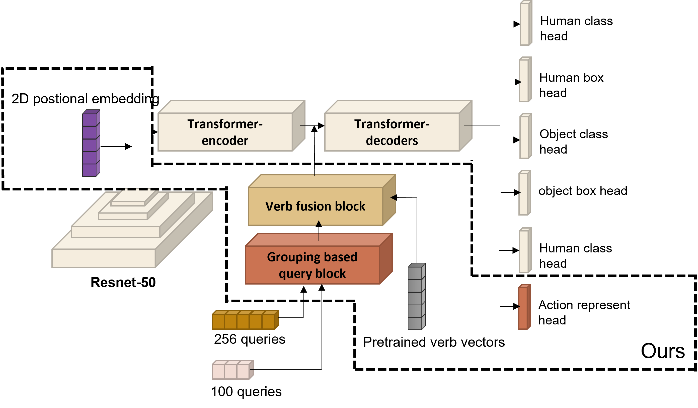

# Group-HOI Detector with Multi-modal Supervision

**Authors:** Yunxiang Liu (u7191378) Shiqiao Zhou (u7155524) Kai Xi (u6458119)

The  [source codes](https://github.com/bbepoch/HoiTransformer) of baseline comes from:  [End-to-End Human Object Interaction Detection with HOI Transformer](https://arxiv.org/abs/2103.04503) published by Zou.etc, thanks for their contribution.


Although the baseline model comes from the [HOiTrans](https://github.com/bbepoch/HoiTransformer) , it's not relate much on our contributions shown on the report, our contributions mainly in: 

[models/modal_fusion_block.py]:models/modal_fusion_block.py
[models/grouping_encoder.py]:models/grouping_encoder.py
[models/position_encoding.py]:models/position_encoding.py


## structure-I (Grouping-based Query Block)


<div align="center">
  
</div>

## structure-II ( Grouping-based Decoder)


## Pretrained models of baseline

| datasets | backbone                                                     |
| -------- | ------------------------------------------------------------ |
| HICO-DET | [Res50](https://drive.google.com/file/d/1-WQnnTHB7f7X2NpqPVqIO6tvWN6k1Ot8/view?usp=sharing) |
| V-COCO   | [Res101](https://drive.google.com/file/d/1HZH3fUpiou2-f91_OvHnTX6feZNqxHa7/view?usp=sharing) |
| HOI-A    | [Res50](https://drive.google.com/file/d/1bNrFQ6a8aKBzwWc0MAdG2f24StMP9lhY/view?usp=sharing) |

## Our model checkpoints

You could download the checkpoints of structue II via [Link](https://drive.google.com/file/d/1bTdnNYDHEyroxeQrDVQYwopNMUEEBEBL/view?usp=sharing)

## Performance

|Model|HICO-DET (Full/Rare/NonRare)|HOI-A|
|---|---|---|
|Res50|28.92/19.83/31.64|73.23|

## Reproduction

### Setting for environments

1.create environments (optional, but recommend for conda users)

```bash
conda create -n comp8536 python=3.8
```

```bash
conda activate comp8536
```

2.download pytorch

```bash
pip install torch==1.11.0+cu113 torchvision==0.12.0+cu113 torchaudio==0.11.0 --extra-index-url https://download.pytorch.org/whl/cu113
```

3.download requirements

```bash
pip install -r requirements.txt
```


### Simple reproduction

We only run our project through HICO-DET dataset, you could download the  images with annotation under the [Link](https://drive.google.com/file/d/1sOutTAUK4ERLJ2Vcg_wXT4kqZhh9tPWg/view?usp=sharing). After downloading, please unzip this fold as well as images in images.tar.gz.

### Reproduce for other datasets

Currently, we do our project only on hico-DET dataset. However, if you would like to try other benchmarks, we recomend you to setup in the following steps as the  [source codes](https://github.com/bbepoch/HoiTransformer)  provided:

1.Download the MS-COCO pretrained [DETR](https://github.com/facebookresearch/detr) model.

```bash
cd data/detr_coco && bash download_model.sh
```

2.Download the annotation files for HICO-DET, V-COCO and HOI-A.

```bash
cd data && bash download_annotations.sh
```

3.Download the image files for [HICO-DET](https://drive.google.com/open?id=1QZcJmGVlF9f4h-XLWe9Gkmnmj2z1gSnk), [V-COCO](https://cocodataset.org/#download) and [HOI-A](https://drive.google.com/drive/folders/15xrIt-biSmE9hEJ2W6lWlUmdDmhatjKt). Instead, we provide a [script](data/download_images.sh) to get all of them.

 A required directory structure is:

        HoiTransformer/
        ├── data/
        │   ├── detr_coco/
        │   ├── hico/
        │   │   ├── eval/
        │   │   └── images/
        │   │       ├── train2015/
        │   │       └── test2015/
        │   ├── hoia/
        │   │   ├── eval/
        │   │   └── images/
        │   │       ├── trainval/
        │   │       └── test/
        │   └── vcoco/
        │       ├── eval/
        │       └── images/
        │           ├── train2014/
        │           └── val2014/
        ├── datasets/
        ├── models/
        ├── tools/
        ├── util/
        ├── engin.py
        ├── main.py
        └── test.py

OPTIONAL SETTINGS. When the above subdirectories in 'data' are all ready, you can train a model on any one of the three benchmarks. But before that, we highly recommend you to move the whole folder 'data' to another place on your computer, e.g. '/home/hoi/data', and only put a soft link named 'data' under 'HoiTransformer'.

```bash
# Optional but recommended to separate data from code.
ln -s /PATH/TO/data data

# If you implement the project on windows:
cd /data/hico
mklink /D images /PATH/TO/images
```

Train a model.

```
# For distributed training
python3 -m torch.distributed.launch --nproc_per_node=4 --use_env main.py --model_type II --epochs=150 --lr_drop=110 --dataset_file=hico --batch_size=4 --backbone=resnet50-hico --have_fusion_block --position_embedding sine-2d --freeze_backbone

# For non-distrubuted training:
python main.py --epochs=150 --lr_drop=110 --dataset_file=hico --batch_size=2 --world_size 1 --backbone=resnet50-hico --freeze_backbone --resume
```

Test a model.

```
python test.py --model_type II --backbone=resnet50-hico --batch_size=1 --dataset_file=hico --log_dir=./ --model_path=your_model_path --have_fusion_block --position_embedding sine-2d
```

Model  inference.

```
python test_on_images.py --model_type II --dataset_file=hico --backbone=resnet50-hico --batch_size=1 --log_dir=./ --model_path=your_model_path --img_sheet=your_image_sheet_file
```


## Annotations

 [source codes](https://github.com/bbepoch/HoiTransformer)  propose a new annotation format 'ODGT' which is much easier to understand, and they have provided annotation files for all the existing benchmarks, i.e. HICO-DET, HOI-A, V-COCO, so you don't have to know how to get it, just use it. The core structure of 'ODGT' format is:
```
{
    file_name: XXX.jpg,
    width: image width,
    height: image height,
    gtboxes: [
        {
            box: [x, y, w, h],
            tag: object category name,
        },
        ...
    ],
    hoi: [
        {
            subject_id: human box index in gtboxes,
            object_id: object box index in gtboxes,
            interaction: hoi category name,
        },
        ...
    ],
}
```

## Paper of source code Citation

```
@inproceedings{zou2021_hoitrans,
  author = {Zou, Cheng and Wang, Bohan and Hu, Yue and Liu, Junqi and Wu, Qian and Zhao, Yu and Li, Boxun and Zhang, Chenguang and Zhang, Chi and Wei, Yichen and Sun, Jian},
  title = {End-to-End Human Object Interaction Detection with HOI Transformer},
  booktitle={CVPR},
  year = {2021},
}
```


## Acknowledgement
We sincerely thank all previous works, especially [HOiTrans](https://github.com/bbepoch/HoiTransformer)  and [GroupViT](https://github.com/NVlabs/GroupViT). I used their codes as baseline or refer the model design of the project.

